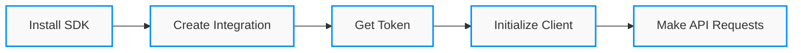
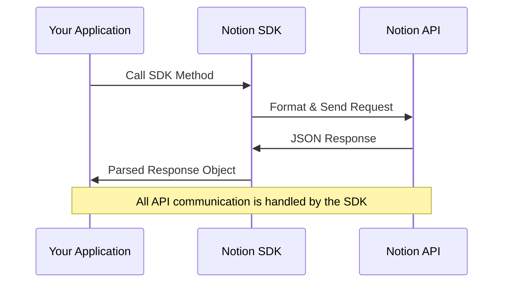
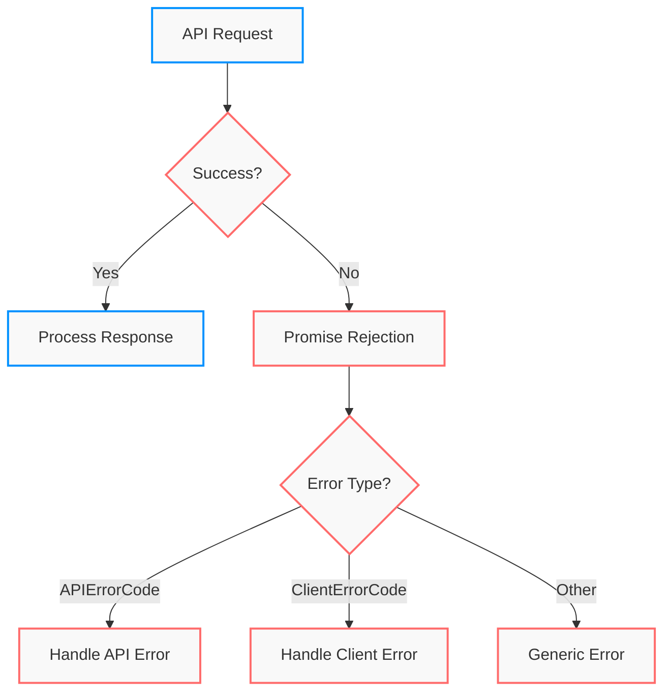
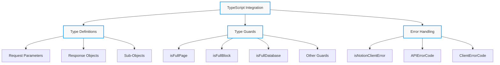
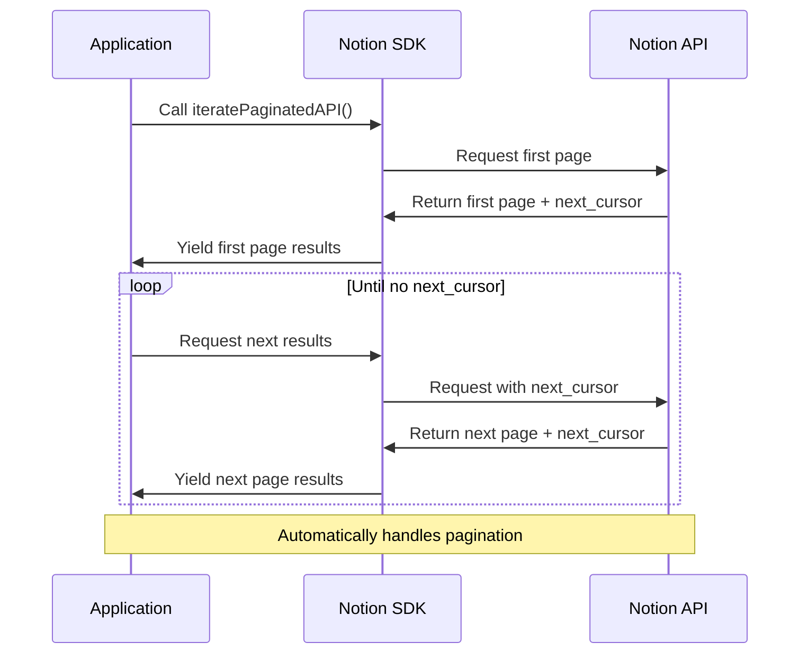

<div align="center">
	<h1>🚀 Notion SDK for JavaScript</h1>
	<p>
		<b>A simple and powerful client for the <a href="https://developers.notion.com">Notion API</a></b>
	</p>
	<p>Build apps, integrations, and workflows with the Notion platform</p>
	<br>
</div>

<div align="center">
	

[](https://www.npmjs.com/package/@notionhq/client)
[](https://opensource.org/licenses/MIT)
[](https://www.typescriptlang.org/)

</div>

## 📋 Table of Contents

- [Installation](#-installation)
- [Getting Started](#-getting-started)
- [Usage Examples](#-usage-examples)
- [Error Handling](#-error-handling)
- [Logging](#-logging)
- [Client Options](#-client-options)
- [TypeScript Support](#-typescript-support)
- [Pagination Utilities](#-pagination-utilities)
- [Requirements](#-requirements)
- [Getting Help](#-getting-help)
- [Files in Repository](#-files-in-repository)

## 📦 Installation

```bash
npm install @notionhq/client
```

## 🚀 Getting Started

> 💡 First time with the Notion API? Start with Notion's [Getting Started Guide](https://developers.notion.com/docs/getting-started).

### Setup Flow



Import and initialize a client using an **integration token** or an OAuth **access token**:

```javascript
const { Client } = require("@notionhq/client")

// Initializing a client
const notion = new Client({
  auth: process.env.NOTION_TOKEN,
})
```

## 🔍 Usage Examples

> 📚 See the complete list of endpoints in the [API reference](https://developers.notion.com/reference).

### Making API Requests



Make a request to any Notion API endpoint:

```javascript
// List all users
const listUsersResponse = await notion.users.list({})
console.log(listUsersResponse)
```

Example response:

```javascript
{
  results: [
    {
      object: 'user',
      id: 'd40e767c-d7af-4b18-a86d-55c61f1e39a4',
      type: 'person',
      person: {
        email: 'avo@example.org',
      },
      name: 'Avocado Lovelace',
      avatar_url: 'https://secure.notion-static.com/e6a352a8-8381-44d0-a1dc-9ed80e62b53d.jpg',
    },
    // ...more users
  ]
}
```

### Querying Databases

Endpoint parameters are grouped into a single object—no need to remember which parameters go in the path, query, or body:

```javascript
const myPage = await notion.databases.query({
  database_id: "897e5a76-ae52-4b48-9fdf-e71f5945d1af",
  filter: {
    property: "Landmark",
    rich_text: {
      contains: "Bridge",
    },
  },
})
```

## ⚠️ Error Handling



If the API returns an unsuccessful response, the returned `Promise` rejects with an `APIResponseError`.

The error contains properties from the response, and the most helpful is `code`. You can compare `code` to the values in the `APIErrorCode` object to avoid misspelling error codes:

```js
const { Client, APIErrorCode } = require("@notionhq/client")

try {
  const notion = new Client({ auth: process.env.NOTION_TOKEN })
  const myPage = await notion.databases.query({
    database_id: databaseId,
    filter: {
      property: "Landmark",
      rich_text: {
        contains: "Bridge",
      },
    },
  })
} catch (error) {
  if (error.code === APIErrorCode.ObjectNotFound) {
    //
    // For example: handle by asking the user to select a different database
    //
  } else {
    // Other error handling code
    console.error(error)
  }
}
```

## 📝 Logging

The client emits useful information to a logger. By default, it only emits warnings and errors.

If you're debugging an application and would like the client to log response bodies, set the `logLevel` option to `LogLevel.DEBUG`:

```js
const { Client, LogLevel } = require("@notionhq/client")

const notion = new Client({
  auth: process.env.NOTION_TOKEN,
  logLevel: LogLevel.DEBUG,
})
```

You may also set a custom `logger` to emit logs to a destination other than `stdout`. A custom logger is a function which is called with 3 parameters: `logLevel`, `message`, and `extraInfo`. The custom logger should not return a value.

## ⚙️ Client Options

The `Client` supports the following options on initialization. These options are all keys in the single constructor parameter:

| Option      | Default value              | Type         | Description                                                                                                                                                  |
| ----------- | -------------------------- | ------------ | ------------------------------------------------------------------------------------------------------------------------------------------------------------ |
| `auth`      | `undefined`                | `string`     | Bearer token for authentication. If left undefined, the `auth` parameter should be set on each request.                                                      |
| `logLevel`  | `LogLevel.WARN`            | `LogLevel`   | Verbosity of logs the instance will produce. By default, logs are written to `stdout`.                                                                       |
| `timeoutMs` | `60_000`                   | `number`     | Number of milliseconds to wait before emitting a `RequestTimeoutError`                                                                                       |
| `baseUrl`   | `"https://api.notion.com"` | `string`     | The root URL for sending API requests. This can be changed to test with a mock server.                                                                       |
| `logger`    | Log to console             | `Logger`     | A custom logging function. This function is only called when the client emits a log that is equal or greater severity than `logLevel`.                       |
| `agent`     | Default node agent         | `http.Agent` | Used to control creation of TCP sockets. A common use is to proxy requests with [`https-proxy-agent`](https://github.com/TooTallNate/node-https-proxy-agent) |

## 🔷 TypeScript Support

This package contains type definitions for all request parameters and responses, as well as some useful sub-objects from those entities.



Because errors in TypeScript start with type `any` or `unknown`, you should use the `isNotionClientError` type guard to handle them in a type-safe way. Each `NotionClientError` type is uniquely identified by its `error.code`. Codes in the `APIErrorCode` enum are returned from the server. Codes in the `ClientErrorCode` enum are produced on the client.

```ts
try {
  const response = await notion.databases.query({
    /* ... */
  })
} catch (error: unknown) {
  if (isNotionClientError(error)) {
    // error is now strongly typed to NotionClientError
    switch (error.code) {
      case ClientErrorCode.RequestTimeout:
        // ...
        break
      case APIErrorCode.ObjectNotFound:
        // ...
        break
      case APIErrorCode.Unauthorized:
        // ...
        break
      // ...
      default:
        // you could even take advantage of exhaustiveness checking
        assertNever(error.code)
    }
  }
}
```

#### Type guards

There are several [type guards](https://www.typescriptlang.org/docs/handbook/advanced-types.html#type-guards-and-differentiating-types)
provided to distinguish between full and partial API responses.

| Type guard function    | Purpose                                                                                |
| ---------------------- | -------------------------------------------------------------------------------------- |
| `isFullPage`           | Determine whether an object is a full `PageObjectResponse`                             |
| `isFullBlock`          | Determine whether an object is a full `BlockObjectResponse`                            |
| `isFullDatabase`       | Determine whether an object is a full `DatabaseObjectResponse`                         |
| `isFullPageOrDatabase` | Determine whether an object is a full `PageObjectResponse` or `DatabaseObjectResponse` |
| `isFullUser`           | Determine whether an object is a full `UserObjectResponse`                             |
| `isFullComment`        | Determine whether an object is a full `CommentObjectResponse`                          |

Here is an example of using a type guard:

```typescript
const fullOrPartialPages = await notion.databases.query({
  database_id: "897e5a76-ae52-4b48-9fdf-e71f5945d1af",
})
for (const page of fullOrPartialPages.results) {
  if (!isFullPageOrDatabase(page)) {
    continue
  }
  // The page variable has been narrowed from
  //      PageObjectResponse | PartialPageObjectResponse | DatabaseObjectResponse | PartialDatabaseObjectResponse
  // to
  //      PageObjectResponse | DatabaseObjectResponse.
  console.log("Created at:", page.created_time)
}
```

## 🔄 Pagination Utilities

This package exports utility functions that are helpful for dealing with any of the paginated APIs.



#### `iteratePaginatedAPI(listFn, firstPageArgs)`

This utility turns any paginated API into an async iterator.

**Parameters:**

- `listFn`: Any function on the Notion client that represents a paginated API (i.e. accepts
  `start_cursor`.) Example: `notion.blocks.children.list`.
- `firstPageArgs`: Arguments that should be passed to the API on the first and subsequent calls
  to the API, for example a `block_id`.

**Returns:**

An [async iterator](https://developer.mozilla.org/en-US/docs/Web/JavaScript/Reference/Iteration_protocols#the_async_iterator_and_async_iterable_protocols)
over results from the API.

**Example:**

```javascript
for await (const block of iteratePaginatedAPI(notion.blocks.children.list, {
  block_id: parentBlockId,
})) {
  // Do something with block.
}
```

#### `collectPaginatedAPI(listFn, firstPageArgs)`

This utility accepts the same arguments as `iteratePaginatedAPI`, but collects
the results into an in-memory array.

Before using this utility, check that the data you are dealing with is
small enough to fit in memory.

**Parameters:**

- `listFn`: Any function on the Notion client that represents a paginated API (i.e. accepts
  `start_cursor`.) Example: `notion.blocks.children.list`.
- `firstPageArgs`: Arguments that should be passed to the API on the first and subsequent calls
  to the API, for example a `block_id`.

**Returns:**

An array with results from the API.

**Example:**

```javascript
const blocks = await collectPaginatedAPI(notion.blocks.children.list, {
  block_id: parentBlockId,
})
// Do something with blocks.
```

## 🛠️ Requirements

This package supports the following minimum versions:

- Runtime: `node >= 12`
- Type definitions (optional): `typescript >= 4.5`

Earlier versions may still work, but we encourage people building new applications to upgrade to the current stable.

## 📄 Files in Repository

| File Name | Description |
|-----------|-------------|
| .cspell.json | CSpell configuration file for spell checking |
| .eslintignore | Specifies files ignored by ESLint |
| .eslintrc.js | ESLint configuration file |
| .gitignore | Specifies files ignored by Git |
| .nvmrc | Node Version Manager configuration |
| .prettierignore | Specifies files ignored by Prettier |
| .prettierrc | Prettier code formatter configuration |
| .roomodes | Room modes configuration |
| add-files-to-notion.js | Script to add files to Notion |
| aigi.md | AI guidance information |
| client.js | Client-side JavaScript file |
| delete-notion-entries.js | Script to delete Notion entries |
| enhance-notion-structure.js | Script to enhance Notion structure |
| index.html | Main HTML file |
| jest.config.js | Jest testing framework configuration |
| LICENSE | License information for the project |
| notion-test-readme.md | Readme file for Notion testing |
| package.json | NPM package configuration |
| README.md | Main project documentation |
| server.js | Server-side JavaScript file |
| share-database-guide.html | Guide for sharing Notion databases |
| tsconfig.json | TypeScript configuration file |

## 💬 Getting Help

If you want to submit a feature request for Notion's API, or are experiencing any issues with the API platform, please email us at `developers@makenotion.com`.

To report issues with the SDK, it is possible to [submit an issue](https://github.com/makenotion/notion-sdk-js/issues) to this repo. However, we don't monitor these issues very closely. We recommend you reach out to us at `developers@makenotion.com` instead.

---

<div align="center">
    <p>Built with ❤️ by the Notion Developer Relations team</p>
</div>
