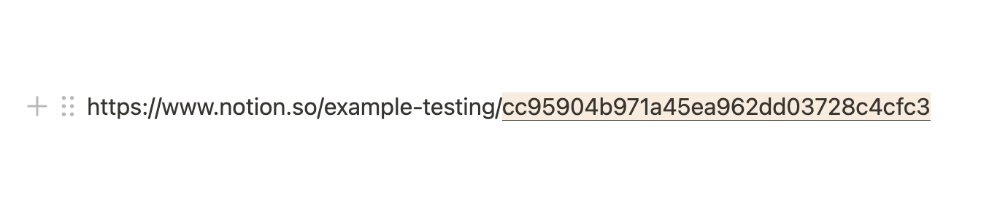

# Introduction to using Notion's SDK for JavaScript

## Learn how to make Public API requests

Use this sample code to learn how to make Public API requests with varying degrees of difficulty.

The sample code is split into two sections:

1. `basic`
2. `intermediate`

(An `advanced` section will soon be added, as well.)

If you are new to Notion's SDK for JavaScript, start with the code samples in the `/basic` directory to get more familiar to basic concepts.

The files in each directory will build on each other to increase in complexity. For example, in `/intermediate`, first you will see how to create a database, then how to create a database and add a page to it, and finally create a database, add a page, and query/sort the database.

## Table of contents

In case you are looking for example code for a specific task, the files are divided as follows:

- `/basic/1-add-block.js`: Create a new block and append it to an existing Notion page.
- `/basic/2-add-linked-block.js`: Create and append new blocks, and add a link to the text of a new block.
- `/basic/3-add-styled-block.js`: Create and append new blocks, and apply text styles to them.
- `/intermediate/1-create-a-database.js`: Create a new database with defined properties.
- `/intermediate/2-add-page-to-database.js`: Create a new database and add new pages to it.
- `/intermediate/3-query-database.js`: Create a new database, add pages to it, and filter the database entries (pages).
- `/intermediate/4-sort-database.js`: Create a new database, add pages to it, and filter/sort the database entries (pages).
- `/intermediate/5-upload-file.js`: Upload an file to Notion and attach it to a page as an image block.

## Running locally

### 1. Clone project and install dependencies

To use this example on your machine, clone the repo and move into your local copy:

```zsh
git clone https://github.com/makenotion/notion-sdk-js.git
cd notion-sdk-js
```

Next, move into this example in the `/examples` directory, and install its dependencies:

```zsh
cd examples/intro-to-notion-api
npm install
```

### 2. Set your environment variables in a `.env` file

A `.env.example` file has been included and can be renamed `.env` (or you can run `cp .env.example .env` to copy the file).

Update the environment variables below:

```zsh
NOTION_API_KEY=<your-notion-api-key>
NOTION_PAGE_ID=<notion-page-id>
```

`NOTION_API_KEY`: Create a new integration in the [integrations dashboard](https://www.notion.com/my-integrations) and retrieve the API key from the integration's `Secrets` page.

`NOTION_PAGE_ID`: Use the ID of any Notion page that you want to test adding content to.

The page ID is the 32 character string at the end of any page URL.


### 3. Give the integration access to your page

Your Notion integration will need permission to interact with the Notion page being used for your `NOTION_PAGE_ID` variable. To provide access, do the following:

1. Go to the page in your workspace.
2. Click the `•••` (more menu) on the top-right corner of the page.
3. Scroll to the bottom of the menu and click `Add connections`.
4. Search for and select your integration in the `Search for connections...` menu.

Once selected, your integration will have permission to read content from the page.

**If you are receiving authorization errors, make sure the integration has permission to access the page.**

### 3. Run individual examples

To run each individual example, use the `node` command with the file's path.

For example:

```zsh
node basic/1-add-block.js
```

---

## Additional resources

To learn more, read the [Public API docs](https://developers.notion.com/) for additional information on using Notion's API. The API docs include a series of [guides](https://developers.notion.com/docs) and the [API reference](https://developers.notion.com/reference/intro), which has a full list of available endpoints.

To see more examples of what you can build with Notion, see our other sample integrations in the parent `/examples` directory. To learn how to build an internal integration with an interactive frontend, read the [Build your first integration](https://developers.notion.com/docs/create-a-notion-integration) guide.

To connect with other developers building with Notion, join the [Notion Developers Slack group](https://join.slack.com/t/notiondevs/shared_invite/zt-20b5996xv-DzJdLiympy6jP0GGzu3AMg).
