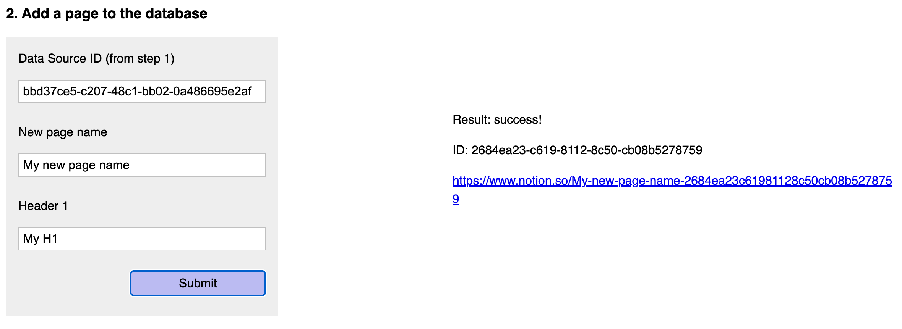

# Notion internal integration full-stack example

## Use web forms to create new databases, pages, page content, and comments

### About the integration

This demo shows how to build an internal integration that allows users to fill out a web form to create new Notion databases, pages, blocks (page content), and comments.


This demo is referenced in the [Create an integration guide](https://developers.notion.com/docs/create-a-notion-integration) -- an introductory guide to building internal integrations and working with Notion's public API.

The goal of this integration is to show how to build a full-stack app where user interactions on the frontend will trigger public API requests, and, as a result, make the corresponding updates in your Notion workspace.

### File structure

On the frontend, this demo includes:

- `views/index.html`, which represents the app's webpage content. Users will interact with the HTML elements in this page.
- `public/client.js`, the client-side JavaScript added to handle HTML form `submit` events.
- `public/style.css` contains the styles for `views/index.html`.

On the backend, this demo includes:

- `server.js`, which serves `index.html` and defines the endpoints used in the client-side JS code. All Notion public API usage (Notion SDK for JavaScript) is included in this file.

#### Notion endpoints used

This demo includes the following Notion endpoint usage:

- [Create a database](https://developers.notion.com/reference/create-a-database)
- [Create a page](https://developers.notion.com/reference/post-page)
- [Append block children](https://developers.notion.com/reference/patch-block-children)
- [Create a comment](https://developers.notion.com/reference/create-a-comment)

This demo can be expanded further to test other endpoints, as well. For example, you could add a button retrieve all database pages or to delete existing pages.

Some "real-world" applications include expanding this demo to be a blog and using a Notion workspace as a CMS. Additionally, the functionality could also be repurposed to receive app feedback from users.

---

### Running locally

#### 1. Set up your local project

```zsh
# Clone this repository locally
git clone https://github.com/makenotion/notion-sdk-js.git

# Switch into this project
cd notion-sdk-js/examples/web-form-with-express/

# Install the dependencies
npm install
```

#### 2. Set your environment variables in a `.env` file

A `.env.example` file has been included and can be renamed `.env`. Update the environment variables below:

```zsh
NOTION_KEY=<your-notion-api-key>
NOTION_PAGE_ID=<notion-page-id>
```

`NOTION_KEY`: Create a new integration in the [integrations dashboard](https://www.notion.com/my-integrations) and retrieve the API key from the integration's `Secrets` page.

`NOTION_PAGE_ID`: Use the ID of any Notion page you want to add databases to. This page will be the parent of all content created through this integration.

The page ID is the 32 character string at the end of any page URL.


#### 3. Give the integration access to your page

Your Notion integration will need permission to create new databases, etc. To provide access, do the following:

1. Go to the page in your workspace.
2. Click the `•••` (more menu) on the top-right corner of the page.
3. Scroll to the bottom of the menu and click `Add connections`.
4. Search for and select your integration in the `Search for connections...` menu.

Once selected, your integration will have permission to read/write content on the page.

**Note**: For the `Add a comment` form to work, you must give your integration permission to read/write comments. To update integration capabilities, visit the `Capabilities` tab in the [integrations dashboard](https://www.notion.com/my-integrations).

#### 4. Run code

Run the following command:

```zsh
npm start
```

Check the terminal response to see which port to use when viewing the app locally in your browser of choice (`localhost:<port>`).

Keep the browser console open to see API responses, including errors.

### Using this app

To use this demo app, start by creating a new database via the database form:


The ID of the new database can be used in the next form to create a new page:


The blocks and comment forms will accept the page ID that is returned from the page form to create new page content (blocks) and comments.


If you have the IDs for other databases/pages, you can use them as long as you have shared the target databases/pages with the internal integration.

To learn more about this demo, read the [Create an integration guide](https://developers.notion.com/docs/create-a-notion-integration), which steps through how this code works.

(Thanks to [Glitch](https://glitch.com/) for the starter app used while creating this demo!)
